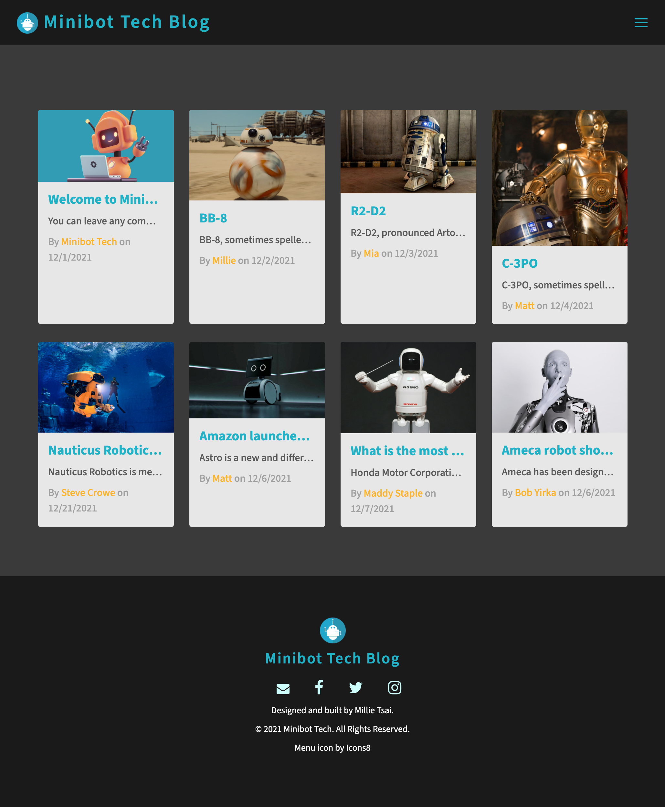

# 14 Model-View-Controller (MVC): Tech Blog

## Description

Built a CMS-style blog site similar to a Wordpress site, where developers can publish their blog posts and comment on other developers’ posts as well. Built this site completely from scratch and deployed it to Heroku. This app follows the MVC paradigm in its architectural structure, using Handlebars.js as the templating language, Sequelize as the ORM, and the express-session npm package for authentication.

## User Story

```md
AS A developer who writes about tech
I WANT a CMS-style blog site
SO THAT I can publish articles, blog posts, and my thoughts and opinions
```

## Acceptance Criteria

```md
GIVEN a CMS-style blog site
WHEN I visit the site for the first time
THEN I am presented with the homepage, which includes existing blog posts if any have been posted; navigation links for the homepage and the dashboard(account); and the option to log in
WHEN I click on the Minibot Tech Blog option on the nav bar or the Home on the menu bar
THEN I am taken to the homepage
WHEN I click on any other links in the menu bar
THEN I am prompted Home, New Post, Account, Log In and Contact options
WHEN I choose to sign up
THEN I am prompted to create a username and password
WHEN I click on the sign-up button
THEN my user credentials are saved and I am logged into the site
WHEN I revisit the site at a later time and choose to log in
THEN I am prompted to enter my username and password
WHEN I am signed in to the site
THEN I see navigation links for Home, My Post(Dashboard), and the option to log out
WHEN I click on the home option in the navigation
THEN I am taken to the homepage and presented with existing blog posts that include the post title and the date created
WHEN I click on an existing blog post
THEN I am presented with the post title, contents, post creator’s username, and date created for that post and have the option to leave a comment
WHEN I enter a comment and click on the submit button while signed in
THEN the comment is saved and the post is updated to display the comment, the comment creator’s username, and the date created
WHEN I click on the My name's Post(Dashboard) option in the navigation
THEN I am taken to the My name's Post(Dashboard) and presented with any blog posts I have already created and the option to add a new blog post
WHEN I click on the New Post button on the menu bar
THEN I am prompted to enter both a title and contents for my blog post
WHEN I click on the button to create a new blog post
THEN the title and contents of my post are saved and I am taken back to an updated My Post (dashboard) with my new blog post
WHEN I click on one of my existing posts in My Post (dashboard)
THEN I am able to delete or update/edit my post and taken back to an updated dashboard
WHEN I click on the logout option in the navigation
THEN I am signed out of the site
```

### Technology Used

- This application’s folder structure follows the Model-View-Controller paradigm.

- Uses the [express-handlebars](https://www.npmjs.com/package/express-handlebars) package to implement Handlebars.js for your Views.

- The application is deployed to Heroku.

## License

[](https://opensource.org/licenses/MIT)

## Website Screenshots



Please click [here](https://minibot-tech.herokuapp.com/) for the minibot tech blog website

© 2021 Trilogy Education Services, LLC, a 2U, Inc. brand. Confidential and Proprietary. All Rights Reserved.
